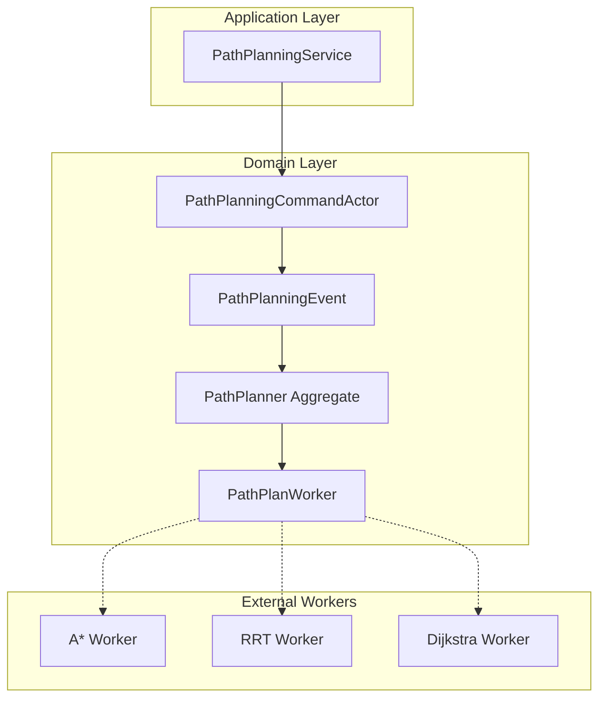

# Path Planning Domain

The Path Planning domain implements a distributed path planning system for autonomous agents using event sourcing and CQRS patterns. This domain handles route requests, manages worker pools, and coordinates path computation tasks across multiple algorithm implementations.

## 🏗️ Architecture Overview



## 📂 Directory Structure

```
src/domains/path_planning/
├── README.md              # This documentation
├── mod.rs                 # Module exports
├── actors.rs              # Command actors for event handling
├── events.rs              # Domain events
├── projections.rs         # Event projections and read models
└── aggregate/             # Core aggregate components
    ├── mod.rs            # Aggregate module exports
    ├── types.rs          # Core data types and structs
    ├── path_planner.rs   # Main PathPlanner aggregate (434 lines)
    ├── worker.rs         # Worker management logic
    ├── plan.rs           # Plan lifecycle management
    └── workspace.rs      # Workspace bounds and obstacles
```

## 🔧 Core Components

### 1. PathPlanner Aggregate (`aggregate/path_planner.rs`)

The main aggregate root that orchestrates the entire path planning process.

**Key Responsibilities:**
- Manages worker registration and lifecycle
- Handles route requests and plan assignments  
- Coordinates work distribution among available workers
- Maintains workspace boundaries and obstacle maps
- Tracks active plans and their statuses

**Core Methods:**
```rust
impl PathPlanner {
    // Worker Management
    pub fn register_worker(&mut self, worker: PathPlanWorker) -> DomainResult<()>
    pub fn mark_worker_ready(&mut self, worker_id: &str) -> DomainResult<()>
    pub fn mark_worker_offline(&mut self, worker_id: &str, reason: String) -> DomainResult<()>
    
    // Plan Management  
    pub fn request_path_plan(&mut self, request: PathPlanRequest) -> DomainResult<String>
    pub fn assign_plan_to_worker(&mut self, plan_id: &str, worker_id: &str, timeout_seconds: u64) -> DomainResult<()>
    pub fn complete_plan(&mut self, plan_id: &str, waypoints: Vec<Position2D>) -> DomainResult<()>
    pub fn fail_plan(&mut self, plan_id: &str, reason: String) -> DomainResult<()>
}
```

### 2. Core Data Types (`aggregate/types.rs`)

**Position2D**
```rust
pub struct Position2D {
    pub x: f64,
    pub y: f64,
}
```

**RouteRequest**
**PathPlanRequest**

```rust
pub struct PathPlanRequest {
    pub request_id: String,
    pub agent_id: String,
    pub start_position: Position2D,
    pub destination_position: Position2D,
    pub start_orientation: Orientation2D,
    pub destination_orientation: Orientation2D,
    pub created_at: DateTime<Utc>,
}
```

**PlanningAlgorithm**
```rust
pub enum PlanningAlgorithm {
    AStar,      // A* pathfinding
    RRT,        // Rapidly-exploring Random Tree
    PRM,        // Probabilistic Roadmap
    Dijkstra,   // Dijkstra's algorithm
    DynamicWindow, // Dynamic Window Approach
}
```

### 3. Worker Management (`aggregate/worker.rs`)

Handles the lifecycle and status of path planning workers.

**WorkerStatus**
```rust
pub enum WorkerStatus {
    Registered,  // Worker registered but not ready
    Ready,       // Available for work assignment
    Busy,        // Currently processing a plan
    Offline,     // Unavailable (maintenance, error, etc.)
}
```

### 4. Event System (`events.rs`)

Comprehensive event model supporting:

**Worker Lifecycle Events:**
- `WorkerRegistered` - New worker joins the system
- `WorkerReady` - Worker becomes available for tasks
- `WorkerBusy` - Worker starts processing a plan
- `WorkerOffline` - Worker becomes unavailable

**Plan Assignment Events:**
- `PlanAssigned` - Plan assigned to a worker
- `PlanAssignmentAccepted` - Worker accepts the assignment
- `PlanAssignmentRejected` - Worker rejects the assignment
- `PlanAssignmentTimedOut` - Assignment expires without response

**Planning Events:**
- `RouteRequested` - New route planning request
- `PlanCompleted` - Successful path generation
- `PlanFailed` - Path planning failed

## 🚀 Getting Started

### 1. Running the PathPlan Worker

The system includes a standalone A* worker implementation:

```bash
# Build the worker
cargo build --bin pathplan-worker

# Run the worker
./target/debug/pathplan-worker
```

**Expected Output:**
```
🤖 Starting PathPlanWorker with A* algorithm
🚀 Worker astar-worker-d02368db-dee0-403a-8be0-02e9301f297d starting up with capabilities: [AStar]
📡 Worker astar-worker-d02368db-dee0-403a-8be0-02e9301f297d waiting for path planning requests...
🎯 Worker received planning request: (28.4, 4.1) -> (16.8, 17.0)
🧠 Starting A* pathfinding from (28.4, 4.1) to (16.8, 17.0)
  🔍 Initializing A* search...
  📊 Building grid and calculating heuristics...
  🎯 Finding optimal path...
Generated waypoint 1: (24.52, 8.44)
Generated waypoint 2: (20.67, 12.74)
Generated waypoint 3: (16.83, 17.03)
  🎉 A* search completed! Found path with 3 waypoints
✅ Worker completed path with 3 waypoints
```

### 2. Creating a PathPlanner

```rust
use gryphon_app::domains::path_planning::*;

// Create a new path planner
let mut planner = PathPlanner::new(
    "planner-001".to_string(),
    PlanningAlgorithm::AStar
);

// Register a worker
let worker = PathPlanWorker::new(
    "worker-001".to_string(),
    vec![PlanningAlgorithm::AStar],
    WorkerStatus::Ready
);
planner.register_worker(worker)?;
```

### 3. Requesting a Route

```rust
use chrono::Utc;

let path_plan_request = PathPlanRequest {
    request_id: "req-001".to_string(),
    agent_id: "agent-001".to_string(),
    start_position: Position2D { x: 0.0, y: 0.0 },
    destination_position: Position2D { x: 10.0, y: 10.0 },
    start_orientation: Orientation2D { angle: 0.0 },
    destination_orientation: Orientation2D { angle: 1.57 }, // 90 degrees
    created_at: Utc::now(),
};

let plan_id = planner.request_path_plan(path_plan_request)?;
println!("Created plan: {}", plan_id);
```

## 🔄 Workflow Examples

### Complete Path Planning Flow

1. **System Initialization**
   ```rust
   // Create planner
   let mut planner = PathPlanner::new("main-planner".to_string(), PlanningAlgorithm::AStar);
   
   // Register workers
   let astar_worker = PathPlanWorker::new("astar-01".to_string(), vec![PlanningAlgorithm::AStar], WorkerStatus::Ready);
   planner.register_worker(astar_worker)?;
   ```

2. **Route Request Processing**
   ```rust
   // Receive route request
   let plan_id = planner.request_route(route_request)?;
   
   // Find available worker
   let worker_id = planner.find_available_worker(&PlanningAlgorithm::AStar)?;
   
   // Assign plan to worker
   planner.assign_plan_to_worker(&plan_id, &worker_id, 30)?; // 30 second timeout
   ```

3. **Worker Processing**
   ```rust
   // Worker accepts assignment
   planner.accept_plan_assignment(&plan_id, &worker_id)?;
   
   // Worker marks itself busy
   planner.mark_worker_busy(&worker_id, &plan_id)?;
   
   // ... worker performs path computation ...
   
   // Worker completes plan
   let waypoints = vec![
       Position2D { x: 2.5, y: 2.5 },
       Position2D { x: 5.0, y: 5.0 },
       Position2D { x: 7.5, y: 7.5 },
       Position2D { x: 10.0, y: 10.0 },
   ];
   planner.complete_plan(&plan_id, waypoints)?;
   
   // Worker becomes ready again
   planner.mark_worker_ready(&worker_id)?;
   ```

### Error Handling Flow

```rust
// Handle worker failure
planner.mark_worker_offline(&worker_id, "Connection lost".to_string())?;

// Handle plan failure
planner.fail_plan(&plan_id, "No valid path found".to_string())?;

// Handle assignment timeout
planner.handle_assignment_timeout(&plan_id, &worker_id)?;
```

## 🎛️ Configuration

### Workspace Configuration

```rust
// Set workspace bounds
let workspace = Workspace {
    bounds: WorkspaceBounds {
        min_x: -50.0, max_x: 50.0,
        min_y: -50.0, max_y: 50.0,
    },
    obstacles: vec![
        // Define obstacles as needed
    ],
};
```

### Worker Capabilities

Workers can support multiple algorithms:

```rust
let multi_algorithm_worker = PathPlanWorker::new(
    "versatile-worker".to_string(),
    vec![
        PlanningAlgorithm::AStar,
        PlanningAlgorithm::Dijkstra,
        PlanningAlgorithm::RRT,
    ],
    WorkerStatus::Ready
);
```

## 🔍 Monitoring and Observability

### Event Tracking

All operations generate events that can be used for:
- **Audit trails** - Complete history of all planning activities
- **Performance monitoring** - Track plan completion times
- **Worker health** - Monitor worker status and availability
- **System debugging** - Trace plan assignments and failures

### Key Metrics to Monitor

- **Plan Success Rate** - Percentage of successfully completed plans
- **Average Planning Time** - Time from request to completion
- **Worker Utilization** - How busy workers are over time
- **Assignment Timeout Rate** - Frequency of assignment timeouts
- **Error Patterns** - Common failure reasons and frequencies

## 🚧 Current Implementation Status

### ✅ Implemented Features

- **Event Sourcing Architecture** - Complete event model with 13 event types
- **Worker Lifecycle Management** - Registration, status tracking, assignment
- **Plan Assignment System** - Timeout handling, acceptance/rejection
- **A* Worker Implementation** - Standalone binary with realistic simulation
- **Domain Model** - Complete aggregate with business logic
- **Type Safety** - Comprehensive type system for positions, orientations, algorithms

### 🔄 In Progress

- **Integration Testing** - End-to-end workflow validation
- **Performance Optimization** - Worker pool sizing and load balancing
- **Error Recovery** - Automatic plan reassignment on worker failure

### 📋 Planned Features

- **Multiple Algorithm Support** - RRT, PRM, Dynamic Window implementations
- **Real Path Planning** - Replace simulation with actual algorithms
- **Distributed Coordination** - Cross-service worker discovery
- **Plan Caching** - Reuse similar path computations
- **Dynamic Obstacles** - Real-time obstacle updates
- **Path Optimization** - Post-processing for smoother paths

## 🛠️ Development Notes

### Adding New Planning Algorithms

1. **Add to PlanningAlgorithm enum** in `types.rs`
2. **Implement worker binary** following `pathplan_worker.rs` pattern
3. **Update worker capabilities** in registration
4. **Test integration** with existing assignment system

### Testing Strategies

```rust
#[cfg(test)]
mod tests {
    use super::*;
    
    #[test]
    fn test_worker_registration() {
        let mut planner = PathPlanner::new("test".to_string(), PlanningAlgorithm::AStar);
        let worker = PathPlanWorker::new("w1".to_string(), vec![PlanningAlgorithm::AStar], WorkerStatus::Ready);
        
        assert!(planner.register_worker(worker).is_ok());
        assert_eq!(planner.registered_workers.len(), 1);
    }
    
    #[test]
    fn test_plan_assignment() {
        // Test complete assignment workflow
    }
}
```

### Performance Considerations

- **Worker Pool Sizing** - Balance between resource usage and responsiveness
- **Plan Timeout Values** - Adjust based on algorithm complexity and expected computation time
- **Event Storage** - Consider event archival strategies for long-running systems
- **Concurrent Plans** - Handle multiple simultaneous planning requests efficiently

## 📚 Related Documentation

- [Application Layer Documentation](../../application/README.md)
- [Event Store Implementation](../../adapters/README.md)
- [Integration Tests](../../../tests/README.md)
- [API Documentation](../../../docs/api/path-planning.md)

---

**Last Updated**: August 18, 2025  
**Domain Version**: 1.0.0  
**Maintainer**: Gryphon App Development Team
